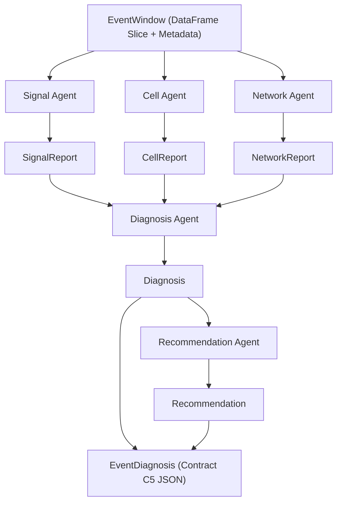

# Multi-Agent Diagnostic Layer Architecture

> Task: `T8-005` — Write `docs/agent_architecture.md`  
> Generated: 2026-10-02  
> System: 5G Network Anomaly Detection System (5G-NADS)

---

## 1. Overview & Rationale

The diagnostic layer of 5G-NADS converts quantitative anomaly detections (`scores.csv`) into structured, interpretable explanations and actionable recommendations.

### Why Deterministic Python? (Decision Record & Overview §37)
1. **Reproducibility & Safety:** Telephony anomaly diagnosis requires deterministic, repeatable, testable logic. Hallucinated causes or non-deterministic assertions are unacceptable in cellular performance monitoring.
2. **Independence from ML:** Machine learning models detect *that* an anomaly occurred (Isolation Forest score / baseline z-score); deterministic rule agents analyze *why* by inspecting window evidence against strict domain thresholds.
3. **No External Dependencies:** The core agent pipeline runs offline with zero external network or API calls.

---

## 2. Agent Execution Flow & Ordering

The `agents/orchestrator.py` runner executes the five domain agents in strict sequential order:

---

## 3. Five Domain Agents: Responsibilities & I/O

Each agent accepts an `EventWindow` slice and returns a frozen dataclass report (defined in `agents/contracts.py`).

| Agent | Module | Input Schema | Output Schema | Primary Responsibility |
|---|---|---|---|---|
| **Signal Agent** | `agents/signal_agent.py` | `EventWindow` | `SignalReport` | Analyzes RSRP, RSRQ, and SINR drops, roll-offs, and persistence. |
| **Cell Agent** | `agents/cell_agent.py` | `EventWindow` | `CellReport` | Detects physical/cell ID changes (PCI, NCI) and frequency hops (NRARFCN). |
| **Network Agent** | `agents/network_agent.py` | `EventWindow` | `NetworkReport` | Inspects RAT shifts (5G NR ↔ LTE) and deployment mode state (`NSA`, `SA`, `UNKNOWN`). |
| **Diagnosis Agent** | `agents/diagnosis_agent.py` | `SignalReport`, `CellReport`, `NetworkReport` | `Diagnosis` | Synthesizes domain reports into a single hedged summary with evidence items. |
| **Recommendation Agent** | `agents/recommendation_agent.py` | `Diagnosis` | `Recommendation` | Maps diagnosis severity and category to monitoring or escalation guidance. |

---

## 4. Input / Output Data Contracts (Contract C6)

### Contract C6 Dataclasses (`agents/contracts.py`)

- **`EventWindow`**:
  - `event_id`: str
  - `session_id`: str
  - `device`: str
  - `operator`: str
  - `start_time`: str
  - `end_time`: str
  - `anomaly_type`: str
  - `severity`: str
  - `window_df`: pd.DataFrame

- **`Diagnosis`**:
  - `summary`: str (Hedged natural language synthesis e.g. *"Possible radio-quality degradation associated with a cell transition."*)
  - `evidence`: list[str] (Bullet points of quantitative facts)
  - `confidence_note`: str (Hedging disclosure e.g. *"correlation, not confirmed cause"*)

- **`Recommendation`**:
  - `text`: str (Guidance text)
  - `kind`: str (`MONITORING`, `INVESTIGATION`, `ESCALATION`)

---

## 5. How to Add a New Agent

To introduce a new specialized domain agent (e.g., `ThroughputAgent`):

1. **Define Contract:** Add input/output dataclass report to `agents/contracts.py`.
2. **Implement Pure Class:** Create `agents/throughput_agent.py` implementing `analyze(window: EventWindow) -> ThroughputReport`. Ensure **no ML imports** (`sklearn`, `torch`) and **no external I/O**.
3. **Register in Orchestrator:** Add execution call in `agents/orchestrator.py` passing outputs into `DiagnosisAgent`.
4. **Add Unit Tests:** Create unit tests in `tests/test_agents.py` enforcing contract schemas and edge cases.

---

## 6. Optional LLM Path & Constraints (Phase 9 Scope)

If natural language rephrasing via a local LLM (Ollama) is enabled (`NADS_USE_LLM=true`):

- **Strict Isolation:** Isolated in `agents/llm_explainer.py`.
- **Read-Only Rephraser:** The LLM receives **only** the already-decided `Diagnosis` text.
- **Forbidden Mutations:** The LLM **must never** modify `is_anomaly`, `anomaly_type`, `severity`, or agent evidence arrays (Guardrail G13).
- **Graceful Timeout:** 10 s HTTP timeout; if Ollama fails or times out, the system seamlessly falls back to deterministic template text.
