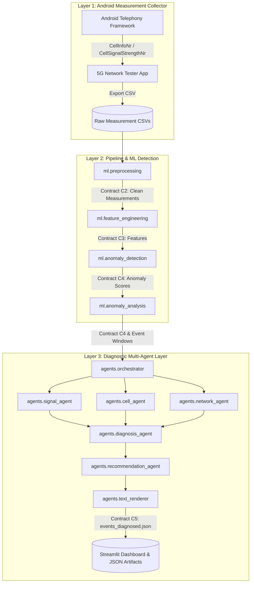
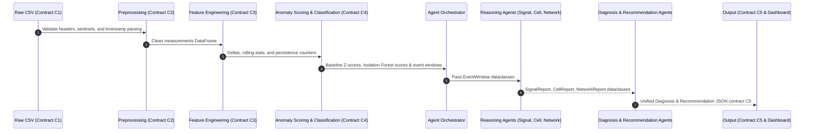

# 5G-NADS System Architecture & Data Flow (T8-002)

This document describes the high-level system architecture, module boundaries, data contracts (C1–C6), and the strict separation of concerns between machine learning detection and multi-agent reasoning.

---

## 1. System Architecture Diagram

---

## 2. Data Flow Diagram

---

## 3. Data Contracts Overview (C1–C6)

| Contract ID | Name | Format / Location | Key Content |
|---|---|---|---|
| **C1** | Raw Telephony CSV | CSV (`data/raw/`) | 18 Android Telephony framework raw signal columns. |
| **C2** | Clean Measurements | CSV (`data/processed/measurements_clean.csv`) | Coerced numeric metrics, timestamps, valid flags, and session IDs. |
| **C3** | Engineered Features | DataFrame | Deltas (`delta_rsrp`), rolling metrics, and run-length persistence flags. |
| **C4** | Anomaly Scores | CSV (`data/processed/scores.csv`) | Baseline z-scores, Isolation Forest anomaly probabilities, and anomaly classifications. |
| **C5** | Diagnosed Events | JSON (`data/processed/events_diagnosed.json`) | Complete multi-agent structured reports, evidence lists, and recommendations. |
| **C6** | Agent Dataclasses | Python Frozen Dataclasses (`agents/contracts.py`) | `EventWindow`, `SignalReport`, `CellReport`, `NetworkReport`, `Diagnosis`, `Recommendation`. |

---

## 4. Separation Statement: ML Detection vs. Agent Reasoning

Per project specification (§30) and Guardrails G9/G14:

1. **Detection Layer (`ml/`)**: Responsible solely for numerical processing, feature extraction, statistical baseline scoring, Isolation Forest inference, and categorical classification. It does not generate text explanations or actionable recommendations.
2. **Diagnostic Layer (`agents/`)**: Responsible solely for qualitative domain reasoning, evidence aggregation, hedged diagnosis attribution, and recommendation formatting. Reasoning agents **NEVER** import `sklearn` or load ML model binary files directly (Guardrail G9).
